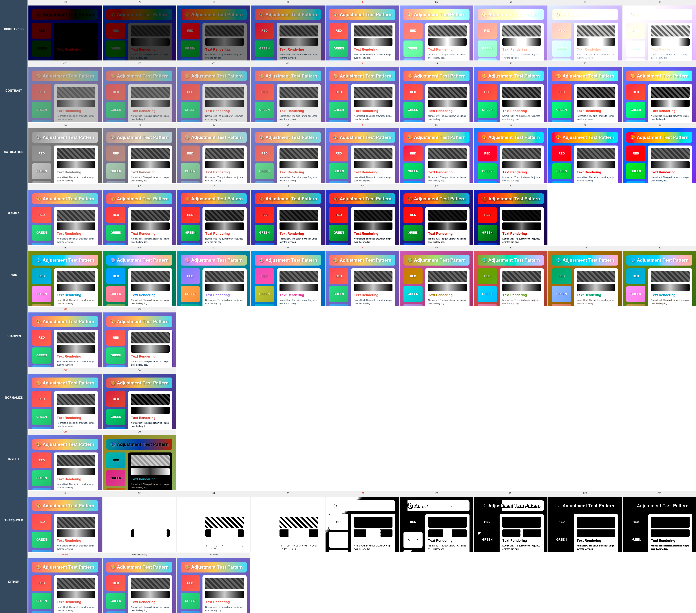
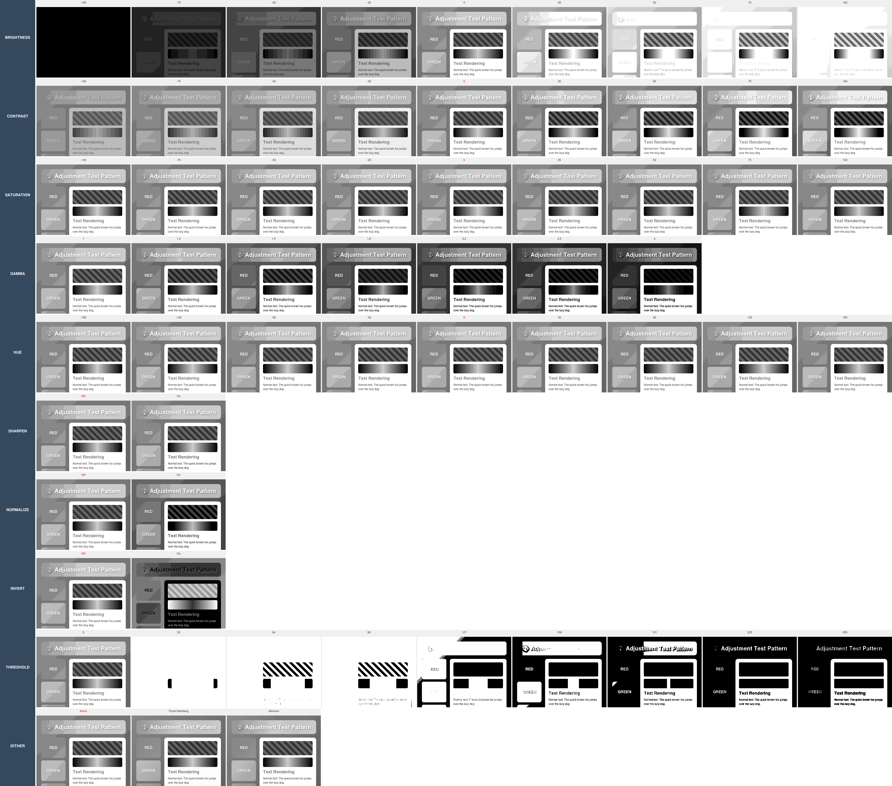
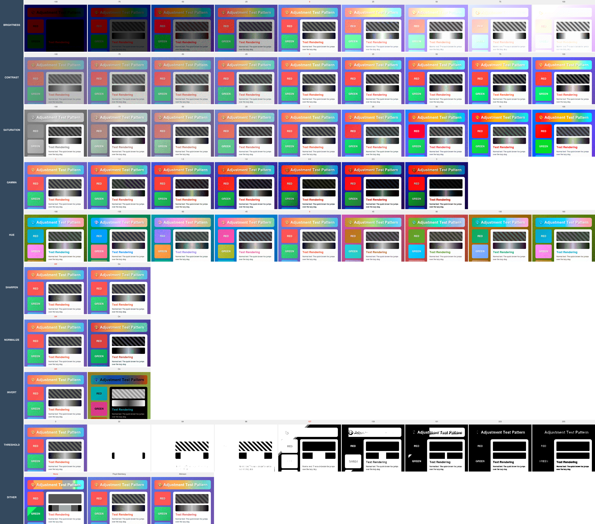
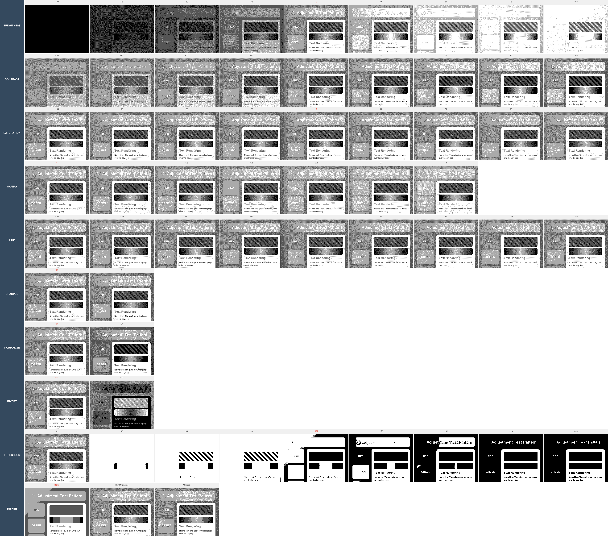

# Image Adjustments

Image adjustments allow you to fine-tune the visual output of your calendar images to match specific display characteristics or aesthetic preferences. This is particularly useful for e-ink displays, outdoor screens, or displays with limited color capabilities.

All adjustments are applied **after** the HTML template is rendered but **before** final image conversion and optional bit depth reduction. This ensures optimal quality while maintaining deterministic output.

## Visual Reference Matrices

The following matrices demonstrate the effect of each adjustment parameter on a colorful test pattern. Compare the different versions to see how adjustments behave across various output formats:

### Color Matrix (Full RGB)

*Full color output showing all adjustment effects on RGB displays*

### Grayscale 8-bit (256 Gray Levels)

*Full grayscale range (256 levels) for monochrome displays*

### Grayscale 4-bit (16 Gray Levels)

*Limited grayscale (16 levels) for displays with reduced color depth*

### Grayscale 2-bit (4 Gray Levels)

*E-ink simulation with 4 gray levels (black, dark gray, light gray, white)*

### Color 2-bit with Dithering

*RGB color with 2-bit depth and Floyd-Steinberg dithering always applied (except dither row)*

### Grayscale 2-bit with Dithering

*Grayscale with 2-bit depth (4 shades) and Floyd-Steinberg dithering always applied (except dither row)*

Each matrix shows 10 adjustment parameters with varying values from left to right. See [ADJUSTMENT-MATRICES.md](ADJUSTMENT-MATRICES.md) for detailed matrix structure and generation information.

---

## Adjustment Parameters

All adjustments are configured in the `adjustments` object within your calendar configuration. Adjustments are optional and can be combined.

### Brightness

**Range**: `-100` to `+100` | **Default**: `0` (no adjustment)

Controls the overall luminosity of the image. Positive values make the image brighter, negative values make it darker.

- **-100**: Maximum darkness (near black)
- **0**: Original brightness
- **+100**: Maximum brightness (near white)

**Use Cases**:
- Compensate for dim displays (+25 to +50)
- Reduce glare on bright screens (-10 to -25)
- Enhance visibility in low-light conditions (+30 to +60)

**Example**:
```json
{
  "adjustments": {
    "brightness": 25
  }
}
```

**Performance**: Fast (native Sharp operation)

---

### Contrast

**Range**: `-100` to `+100` | **Default**: `0` (no adjustment)

Adjusts the difference between light and dark areas. Positive values increase contrast, negative values reduce it.

- **-100**: Minimal contrast (flat, washed out)
- **0**: Original contrast
- **+100**: Maximum contrast (sharp differences)

**Use Cases**:
- Enhance text readability on low-contrast displays (+20 to +40)
- Soften harsh colors for aesthetic purposes (-10 to -20)
- Compensate for display limitations (+30 to +50)

**Example**:
```json
{
  "adjustments": {
    "contrast": 30
  }
}
```

**Performance**: Fast (native Sharp operation)

---

### Saturation

**Range**: `-100` to `+100` | **Default**: `0` (no adjustment)

Controls color intensity. Positive values make colors more vivid, negative values reduce color intensity.

- **-100**: Grayscale (no color)
- **0**: Original saturation
- **+100**: Maximum saturation (vibrant colors)

**Use Cases**:
- Convert to grayscale for monochrome displays (-100)
- Enhance colors for vibrant displays (+20 to +40)
- Reduce color intensity for subtle aesthetics (-20 to -40)

**Example**:
```json
{
  "adjustments": {
    "saturation": -100
  }
}
```

**Note**: For true grayscale conversion, use the `grayscale: true` config option instead, which is more efficient.

**Performance**: Fast (native Sharp operation)

---

### Gamma (Legacy)

**Range**: `0.1` to `3.0` | **Default**: `1.0` (no adjustment)

> **Note**: This is a legacy parameter. For professional-grade control, use `levels.gamma` instead, which supports a wider range (0.1 to 8.0) and integrates with input/output point adjustments.

Adjusts the mid-tone brightness without affecting pure black or pure white. Higher values brighten mid-tones.

- **1.0**: No adjustment (linear)
- **1.5-2.0**: Moderate brightening of mid-tones
- **2.5-3.0**: Strong brightening of mid-tones

**Use Cases**:
- Compensate for displays with poor mid-tone reproduction (1.8 to 2.2)
- Match display gamma curves (typically 2.2 for most LCDs)
- Enhance visibility of dark details (1.5 to 2.0)

**Example**:
```json
{
  "adjustments": {
    "gamma": 2.2
  }
}
```

**Migration**: For more control, use the `levels` adjustment:
```json
{
  "adjustments": {
    "levels": {
      "gamma": 2.2
    }
  }
}
```

**Performance**: Fast (native Sharp operation)

---

### Levels (Paint.NET Style)

**Type**: Object | **Default**: All parameters optional with sensible defaults

Professional-grade levels adjustment providing full control over input/output black/white points and gamma correction. Values match Paint.NET semantics exactly, allowing you to simulate adjustments in Paint.NET and apply the same values here.

**Parameters**:

| Parameter | Type | Range | Default | Description |
|-----------|------|-------|---------|-------------|
| `inputBlack` | integer | 0-255 | 0 | Input black point - pixels at or below this value become black |
| `inputWhite` | integer | 0-255 | 255 | Input white point - pixels at or above this value become white |
| `gamma` | float | 0.1-8.0 | 1.0 | Mid-tone adjustment (matches Paint.NET middle slider) |
| `outputBlack` | integer | 0-255 | 0 | Output black point - darkest output value |
| `outputWhite` | integer | 0-255 | 255 | Output white point - brightest output value |

**Processing Order**:
1. **Input mapping**: Stretch/compress input histogram from `[inputBlack, inputWhite]` to `[0, 255]`
2. **Gamma correction**: Apply non-linear mid-tone adjustment
3. **Output mapping**: Map `[0, 255]` to `[outputBlack, outputWhite]`

**Gamma Values** (Paint.NET-compatible):
- **0.1-0.9**: Dramatically darken mid-tones (non-white pixels become very dark)
- **1.0**: No adjustment (linear)
- **1.5-2.2**: Moderately brighten mid-tones (standard for display compensation)
- **2.5-5.0**: Significantly brighten mid-tones
- **5.0-8.0**: Extreme brightening (near-white becomes white, only darkest pixels remain dark)

**Use Cases**:
- **Darken emoji icons** without affecting white backgrounds (gamma: 2.5-4.0, outputBlack: 30-50)
- **E-ink optimization** with precise control over contrast and tonal range
- **Match Paint.NET adjustments** exactly (use same values from Paint.NET levels dialog)
- **Professional color grading** with full histogram control

**Example - Full Control (Paint.NET style)**:
```json
{
  "adjustments": {
    "levels": {
      "inputBlack": 0,
      "inputWhite": 255,
      "gamma": 2.2,
      "outputBlack": 40,
      "outputWhite": 255
    }
  }
}
```

**Example - Darken Mid-Tones (Emoji Use Case)**:
```json
{
  "adjustments": {
    "levels": {
      "gamma": 3.0,
      "outputBlack": 30
    }
  }
}
```

**Example - Compress Output Range**:
```json
{
  "adjustments": {
    "levels": {
      "outputBlack": 50,
      "outputWhite": 220
    }
  }
}
```

**Example - Expand Input Range**:
```json
{
  "adjustments": {
    "levels": {
      "inputBlack": 30,
      "inputWhite": 200
    }
  }
}
```

**Compatibility**:
- If both `gamma` (legacy) and `levels.gamma` are present, `levels.gamma` takes precedence
- If only `gamma` is set, it's treated as `levels.gamma` internally
- Works with both color and grayscale images
- Can be combined with other adjustments (brightness, contrast, etc.)

**Paint.NET Mapping**:
This implementation exactly matches Paint.NET's Levels adjustment dialog:
- **Input Histogram** → `inputBlack` (left slider), `inputWhite` (right slider)
- **Middle Slider** → `gamma` (0.1 to 8.0 range)
- **Output Histogram** → `outputBlack` (left slider), `outputWhite` (right slider)


**Performance**: Fast (native Sharp operations)

---

### Hue

**Range**: `-180` to `+180` degrees | **Default**: `0` (no adjustment)

Rotates colors around the color wheel. Useful for color-shifting the entire image.

- **-180/+180**: Complete color inversion (same result)
- **-90**: Shift blues to greens, reds to blues, etc.
- **0**: Original colors
- **+90**: Shift blues to magentas, greens to yellows, etc.

**Use Cases**:
- Creative color themes (±30 to ±60)
- Color accessibility adjustments (±45 to ±90)
- Seasonal theming (e.g., +30 for warmer autumn tones)

**Example**:
```json
{
  "adjustments": {
    "hue": 45
  }
}
```

**Performance**: Fast (native Sharp operation)

---

### Sharpen

**Type**: Boolean | **Default**: `false`

Applies edge enhancement to make text and details appear crisper.

- **false**: No sharpening
- **true**: Apply sharpening

**Use Cases**:
- Improve text legibility on low-resolution displays
- Enhance small calendar details
- Compensate for display blur

**Example**:
```json
{
  "adjustments": {
    "sharpen": true
  }
}
```

**Note**: Uses Sharp's default sharpening parameters. Over-sharpening can introduce artifacts.

**Performance**: Moderate (convolution operation)

---

### Normalize

**Type**: Boolean | **Default**: `false`

Automatically adjusts brightness and contrast to use the full dynamic range (stretches histogram).

- **false**: Original tone distribution
- **true**: Auto-enhance to fill 0-255 range

**Use Cases**:
- Automatically improve low-contrast images
- Ensure consistent brightness across different calendar sources
- Maximize visibility without manual tuning

**Example**:
```json
{
  "adjustments": {
    "normalize": true
  }
}
```

**Note**: Normalization happens after all other adjustments. Results vary based on image content.

**Performance**: Fast (native Sharp operation)

---

### Invert

**Type**: Boolean | **Default**: `false`

Inverts all colors (creates a photographic negative effect).

- **false**: Normal colors
- **true**: Inverted colors (negative)

**Use Cases**:
- Dark mode calendars (white background → black)
- High-contrast displays with inverted preferences
- Artistic effects

**Example**:
```json
{
  "adjustments": {
    "invert": true
  }
}
```

**Performance**: Fast (native Sharp operation)

---

### Threshold

**Range**: `0` to `255` | **Default**: None (not applied)

Converts the image to pure black and white based on a brightness threshold. Pixels brighter than the threshold become white, darker pixels become black.

- **0**: All white (everything above threshold)
- **127**: Balanced black/white (50% threshold)
- **255**: All black (everything below threshold)

**Use Cases**:
- High-contrast e-ink displays (values around 127-159)
- Binary displays (1-bit black and white)
- Artistic high-contrast effects

**Example**:
```json
{
  "adjustments": {
    "threshold": 140
  }
}
```

**Note**: Applied before dithering. For better results on e-ink, combine with dithering.

**Performance**: Fast (native Sharp operation)

---

### Dither

**Type**: Boolean or String | **Default**: `false`

Applies dithering algorithms to simulate more gray levels on low bit-depth displays.

- **false**: No dithering
- **true**: Same as `"floyd-steinberg"`
- **"floyd-steinberg"**: Error diffusion dithering (7/16 to 4 neighbors)
- **"atkinson"**: Lighter error diffusion (1/8 to 6 neighbors)

**Algorithms**:

**Floyd-Steinberg** (1976):
- Distributes quantization error to 4 neighboring pixels
- Produces detailed, high-quality dithering
- Standard for most applications
- Error weights: 7/16 (right), 3/16 (bottom-left), 5/16 (bottom), 1/16 (bottom-right)

**Atkinson** (1984):
- Distributes error to 6 neighboring pixels
- Lighter, more artistic appearance
- Original Mac algorithm
- Error weights: 1/8 to each of 6 neighbors (some error discarded)

**Use Cases**:
- E-ink displays with limited gray levels (2-bit, 4-bit)
- Improve gradient appearance on low bit-depth displays
- Create artistic stippled effects (Atkinson)

**Example**:
```json
{
  "adjustments": {
    "dither": "floyd-steinberg"
  }
}
```

**Note**: Dithering is applied **after** all other adjustments and bit depth reduction. Best combined with `bitDepth` and/or `grayscale` settings.

**Performance**: Slow (custom JavaScript implementation, O(width × height))

---

## Combining Adjustments

Multiple adjustments can be combined. They are applied in this order:

1. **Normalize** - Auto-enhance (stretches histogram)
2. **Levels** - Input mapping → Gamma → Output mapping (replaces old gamma)
3. **Brightness** - Linear adjustment
4. **Contrast** - Linear adjustment
5. **Saturation** - Color intensity
6. **Hue** - Color rotation
7. **Sharpen** - Edge enhancement
8. **Invert** - Color inversion
9. **Threshold** - Binary conversion
10. **Dithering** - Error diffusion (after bit depth reduction)

**Example - E-ink Display Optimization**:
```json
{
  "grayscale": true,
  "bitDepth": 2,
  "adjustments": {
    "brightness": 10,
    "contrast": 30,
    "levels": {
      "gamma": 1.8
    },
    "sharpen": true,
    "dither": "floyd-steinberg"
  }
}
```

**Example - Outdoor LCD Enhancement**:
```json
{
  "adjustments": {
    "brightness": 25,
    "contrast": 40,
    "saturation": 20,
    "sharpen": true
  }
}
```

**Example - Dark Mode Calendar**:
```json
{
  "adjustments": {
    "invert": true,
    "brightness": -10,
    "contrast": 15
  }
}
```

---

## Performance Considerations

### Fast Operations (< 10ms)
- Brightness, Contrast, Saturation
- Gamma, Hue
- Sharpen, Normalize, Invert, Threshold

These use Sharp's native C++ operations and have minimal performance impact.

### Slow Operations (50-500ms)
- **Dithering** (Floyd-Steinberg, Atkinson)

Dithering algorithms are implemented in JavaScript and process every pixel. For a 800×480 image:
- Floyd-Steinberg: ~100-200ms
- Atkinson: ~100-200ms

**Recommendation**: Use pre-generation (`preGenerateInterval`) when using dithering to avoid request delays.

### Caching

All adjustments are deterministic and fully cached:
- CRC32 checksums include adjustment parameters
- Pre-generated images are cached on disk
- Memory cache stores recently generated images

Identical adjustment configurations always produce identical output (byte-for-byte).

---

## Related Configuration

See [CONFIGURATION.md](CONFIGURATION.md) for complete configuration reference:

- **grayscale**: Convert to grayscale (more efficient than `saturation: -100`)
- **bitDepth**: Reduce color depth (1, 2, 4, 8 bits per pixel)
- **format**: Output format (PNG, BMP, JPEG)
- **preGenerateInterval**: Pre-generate images for faster serving

---

## Visual Testing

To see all adjustment effects side-by-side, generate the adjustment comparison matrices:

```bash
npm run test:matrix
```

This creates 4 matrices (color, 8-bit grayscale, 4-bit grayscale, 2-bit grayscale) showing all parameter combinations. See [ADJUSTMENT-MATRICES.md](ADJUSTMENT-MATRICES.md) for details.

---

## Troubleshooting

**Issue**: Dithering looks blocky or pixelated
- **Solution**: Ensure `bitDepth` is set appropriately (2 or 4 for e-ink)
- **Solution**: Try different threshold values (127-159 for e-ink)
- **Solution**: Experiment with both dithering algorithms

**Issue**: Image is too dark/bright
- **Solution**: Adjust `brightness` first (-50 to +50 range)
- **Solution**: Try `levels.gamma` for mid-tone adjustments (1.5 to 3.0)
- **Solution**: Use `levels` with input/output point control for precise tonal mapping
- **Solution**: Use `normalize: true` for automatic enhancement

**Issue**: Colors look washed out
- **Solution**: Increase `contrast` (+20 to +40)
- **Solution**: Increase `saturation` (+10 to +30)
- **Solution**: Check if `normalize` helps

**Issue**: Adjustments are slow
- **Solution**: Enable pre-generation for frequently-accessed calendars
- **Solution**: Avoid dithering unless necessary
- **Solution**: Use caching and check CRC32 before downloading full image

**Issue**: Text is blurry
- **Solution**: Enable `sharpen: true`
- **Solution**: Increase `contrast` (+20 to +40)
- **Solution**: Use higher resolution templates

---

## Examples by Display Type

### E-ink Display (e.g., Waveshare, Kindle)
```json
{
  "grayscale": true,
  "bitDepth": 2,
  "adjustments": {
    "brightness": 10,
    "contrast": 35,
    "levels": {
      "gamma": 1.8
    },
    "sharpen": true,
    "threshold": 140,
    "dither": "floyd-steinberg"
  }
}
```

### E-ink with Darkened Emojis/Icons
```json
{
  "grayscale": true,
  "bitDepth": 4,
  "adjustments": {
    "levels": {
      "gamma": 3.0,
      "outputBlack": 30
    },
    "sharpen": true,
    "dither": "atkinson"
  }
}
```

### Outdoor LCD (High Brightness)
```json
{
  "adjustments": {
    "brightness": 30,
    "contrast": 45,
    "saturation": 25,
    "sharpen": true
  }
}
```

### OLED Display (Deep Blacks)
```json
{
  "adjustments": {
    "brightness": -5,
    "contrast": 20,
    "saturation": 15,
    "levels": {
      "gamma": 2.2
    }
  }
}
```

### Monochrome LCD (No Grayscale Support)
```json
{
  "grayscale": true,
  "bitDepth": 1,
  "adjustments": {
    "contrast": 40,
    "sharpen": true,
    "threshold": 127,
    "dither": "atkinson"
  }
}
```

**Example - Dark Mode Calendar**:
```json
{
  "adjustments": {
    "invert": true,
    "brightness": -10,
    "contrast": 15,
    "levels": {
      "gamma": 1.5
    }
  }
}
```
