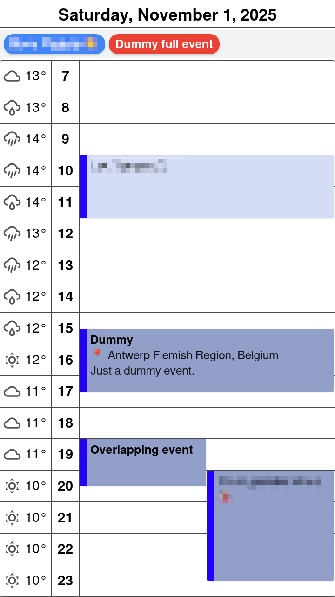

# Day View with Weather template

## Description

This template displays a single day in an Outlook-style calendar view with hourly time slots and events shown as vertical bars. The left column shows weather icons and temperatures for each hour, followed by time labels, and then the main event area where events are displayed as colored bars spanning the hours they occur. Events can overlap and will be arranged in columns automatically. All-day events are shown in a separate section at the top.



## Configuration

The template requires weather data from the Open-Meteo API. To customize the weather location:

1. Find the latitude and longitude of your location (use Google Maps or similar)
2. Update the `extraDataUrl` with your coordinates:
   - Replace `latitude=51.2194` with your latitude
   - Replace `longitude=4.4025` with your longitude
3. The URL format is: `https://api.open-meteo.com/v1/forecast?latitude=YOUR_LAT&longitude=YOUR_LON&hourly=temperature_2m,weather_code`

Example configuration for Antwerp, Belgium:

```json
{
  "icsUrl": "...",
  "template": "week-jan.js",
  "width": 720,
  "height": 1280,
  "grayscale": true,
  "bitDepth": 2,
  "imageType": "png",
  "expandRecurringFrom": -1,
  "expandRecurringTo": 1,
  "locale": "nl-BE",
  "timezone": "Europe/Brussels",
  "extraDataUrl": "https://api.open-meteo.com/v1/forecast?latitude=51.2194&longitude=4.4025&hourly=temperature_2m,weather_code",
  "extraDataCacheTtl": 3600
}
```

## Template Structure

This template consists of three main parts:

### 1. Configuration Section (`CONFIG` object)
Contains all customizable settings organized into logical groups:

- **`time`**: Time display settings
  - `startHour` / `endHour`: Define the visible hour range (e.g., 7 to 24 for 7am to midnight)
  - `format24h`: Use 24-hour (true) or 12-hour (false) time format
  - `showCurrentTimeLine`: Display a red line indicating the current time
  
- **`layout`**: Grid dimensions and spacing
  - `useFixedHeight`: If true, each hour has a fixed height; if false, adapts to viewport
  - `hourHeight`: Height of each hour row (when `useFixedHeight` is true)
  - `weatherColumnWidth` / `timeColumnWidth`: Column widths
  - `eventMinHeightMinutes`: Minimum visual height for events (prevents tiny events)
  - `eventPadding` / `eventMargin` / `eventBorderRadius`: Event bar styling
  - `eventDurationBarWidth`: Width of the colored left border showing event duration
  
- **`features`**: Toggle various display elements
  - `showWeatherColumn`: Display hourly weather icons and temperatures
  - `showEventLocation`: Show location in event details
  - `showEventDescription`: Show description in event details
  
- **`colors`**: Complete color scheme
  - Background, grid lines, current time indicator
  - Event colors (default, past events, borders)
  - All-day event badge colors (cycles through 8 colors)
  
- **`fonts`**: Typography settings for all text elements
  - Day header, time labels, weather information
  - All-day event badges
  - Event titles and details

### 2. Helper Functions
Utility functions that process data and handle layout:

- **`calculateVisualDuration(displayStart, displayEnd)`**: Ensures events have minimum visual height
- **`eventsOverlap(start1, end1, start2, end2)`**: Detects overlapping events
- **`getWeatherIcon(code)`**: Converts WMO weather codes to Material Design SVG icons
- **`formatTime(date)`**: Formats event times according to locale
- **`getHourLabel(hour)`**: Formats hour labels (12h or 24h)
- **`getEventStyle(event)`**: Calculates event position and height percentages
- **`calculateEventColumns(events)`**: Arranges overlapping events into columns
- **`getDayStart(timestamp)`**: Gets start of day timestamp

### 3. Main Template Logic
The core rendering code that:

1. Processes weather data from the `extra` parameter (Open-Meteo API response)
2. Filters events for the current day
3. Separates all-day events from timed events
4. Calculates event positioning and handles overlaps
5. Generates HTML with three main sections:
   - Day header (date)
   - All-day events section (if any)
   - Hour grid with weather, time labels, and event bars
6. Adds current time indicator (if enabled)

**Key Features:**
- **Automatic overlap handling**: Events that overlap are shown side-by-side in columns
- **Minimum event height**: Short events are given a minimum visual height for readability
- **Duration indicator**: A colored left border shows the actual event duration
- **Past event styling**: Events that have ended are shown with a lighter background
- **Weather integration**: Hourly weather icons and temperatures in the left column
- **Responsive grid**: Can use fixed or flexible height for hour rows

**Customization Points:**
- Adjust `time.startHour`/`endHour` to show only relevant hours (e.g., 7am-11pm)
- Set `layout.useFixedHeight` to false for adaptive layouts or true for consistent sizing
- Modify `eventMinHeightMinutes` to control minimum event size (default 60 minutes)
- Change `colors.allDayBadgeColors` array to customize badge colors
- Update `features` toggles to show/hide weather, location, or description
- Adjust `fonts` sizes to fit different screen resolutions

## Template

See [dayview-with-weather.js](dayview-with-weather.js) for the full template code.
