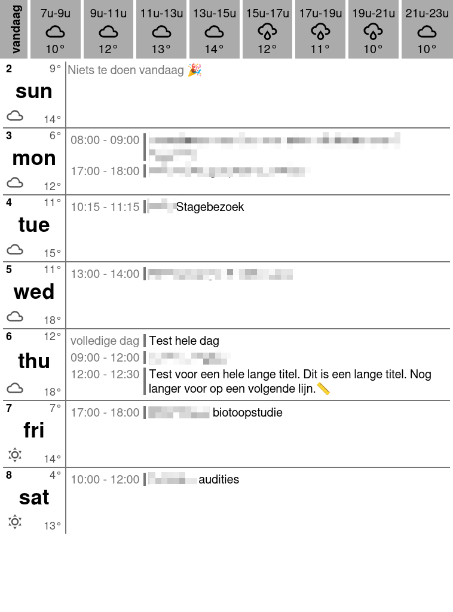

# Week View with Weather Bar template (Small)

## Description

This template displays a week view calendar in a table layout with smaller font sizes, optimized for larger e-ink displays like the InkPlate 6 Flick. Each day is represented as a row with the day name, day number, weather icon, and min/max temperature in the left cell. The right cell shows events with their times and titles, with a colored vertical bar indicator. Events are displayed with time on the left and title on the right. If there are no events for a day, a "no events" message is shown.

The top of the display includes an hourly weather forecast bar for today, showing time blocks with weather icons and temperatures.



## Configuration

The template requires weather data from the Open-Meteo API. To customize the weather location:

1. Find the latitude and longitude of your location (use Google Maps or similar)
2. Update the `extraDataUrl` with your coordinates:
   - Replace `latitude=51.2194` with your latitude
   - Replace `longitude=4.4025` with your longitude
3. The URL format is: `https://api.open-meteo.com/v1/forecast?latitude=YOUR_LAT&longitude=YOUR_LON&hourly=temperature_2m,weather_code`

Example configuration for Antwerp, Belgium:

```json
{
  "icsUrl": "...",
  "template": "weekview-with-weather-bar-small.js",
  "width": 600,
  "height": 800,
  "grayscale": true,
  "bitDepth": 2,
  "imageType": "png",
  "expandRecurringFrom": -1,
  "expandRecurringTo": 7,
  "locale": "nl-BE",
  "timezone": "Europe/Brussels",
  "extraDataUrl": "https://api.open-meteo.com/v1/forecast?latitude=51.2194&longitude=4.4025&hourly=temperature_2m,weather_code",
  "extraDataCacheTtl": 3600
}
```

## Template Structure

This template consists of three main parts:

### 1. Configuration Section (`CONFIG` object)
Contains all customizable settings organized into logical groups:

- **`layout`**: Dimensions and spacing (cell widths, heights, padding, margins)
- **`colors`**: Color scheme for background, borders, and past events
- **`border`**: Border styling (width and style)
- **`fontStyle`**: Typography for all text elements with smaller font sizes for fitting more content on larger displays
  - Day cell: day names, numbers, and weather information
  - Events: titles with vertical bar indicator, times, and "no events" message
- **`todayWeather`**: Today's weather bar appearance and time window configuration
  - Configured for 8 time blocks from 7:00 to 23:00 (2-hour intervals)
  - Smaller icon and font sizes for compact presentation
- **`labels`**: Text strings for localization (no events message, full day label, today label)

### 2. Helper Functions
Utility functions that process data:

- **`getWeatherIcon(code)`**: Converts WMO weather codes to SVG icon paths
- **`findMode(arr)`**: Finds the most common value in an array (for weather aggregation)
- **`processWeatherData(weatherData)`**: Converts hourly weather data into daily min/max temps and icons
- **`createTodayWeatherTable(weatherExtra)`**: Generates the hourly forecast bar at the top
- **`getDayStart(timestamp)`**: Gets the start of day timestamp
- **`formatTime(dateString)`**: Formats event times according to locale

### 3. Main Template Logic
The core rendering code that:

1. Processes weather data from the `extra` parameter (Open-Meteo API response)
2. Creates an array of the next 7 days
3. Groups calendar events by day, handling both all-day and timed events
4. Generates HTML with a weather bar (if today) and a table of days with events
5. Applies all configuration settings to create the final styled output
6. Uses a compact layout with vertical bar indicators for events

**Key Customization Points:**
- Smaller font sizes throughout for fitting more content on larger e-ink displays
- Adjusted `todayWeather.startHour`/`endHour`/`numberOfIntervals` for 8 time blocks
- Event layout shows time on left, title on right with vertical bar indicator
- Modified `layout` dimensions optimized for devices like InkPlate 6 Flick
- Change `colors` for different display modes (grayscale, color, inverted)
- Update `labels` for different languages

## Template

See [weekview-with-weather-bar-small.js](weekview-with-weather-bar-small.js) for the full template code.
