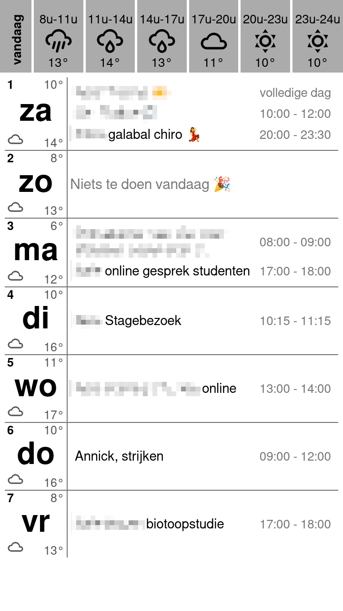

# Week View with Weather Bar template

## Description

This template displays a week view calendar in a simple table layout, with each day represented as a column. Each day's cell includes the day name, day number, weather icon, and min/max temperature at the top. Below that, events for the day are listed with their titles and times. If there are no events for a day, a "no events" message is shown.



## Configuration

The template requires weather data from the Open-Meteo API. To customize the weather location:

1. Find the latitude and longitude of your location (use Google Maps or similar)
2. Update the `extraDataUrl` with your coordinates:
   - Replace `latitude=51.2194` with your latitude
   - Replace `longitude=4.4025` with your longitude
3. The URL format is: `https://api.open-meteo.com/v1/forecast?latitude=YOUR_LAT&longitude=YOUR_LON&hourly=temperature_2m,weather_code`

Example configuration for Antwerp, Belgium:

````json
{
  "icsUrl": "...",
  "template": "weekview-with-weather-bar.js",
  "width": 720,
  "height": 1280,
  "grayscale": true,
  "bitDepth": 2,
  "imageType": "png",
  "expandRecurringFrom": -1,
  "expandRecurringTo": 7,
  "locale": "nl-BE",
  "timezone": "Europe/Brussels",
  "extraDataUrl": "https://api.open-meteo.com/v1/forecast?latitude=51.2194&longitude=4.4025&hourly=temperature_2m,weather_code",
  "extraDataCacheTtl": 3600
}
````

## Template Structure

This template consists of three main parts:

### 1. Configuration Section (`CONFIG` object)
Contains all customizable settings organized into logical groups:

- **`layout`**: Dimensions and spacing (cell widths, heights, padding, margins)
- **`colors`**: Color scheme for background, borders, and past events
- **`border`**: Border styling (width and style)
- **`fontStyle`**: Typography for all text elements (day names, event titles, times, etc.)
- **`todayWeather`**: Today's weather bar appearance and time window configuration
  - **Important**: `startHour`, `endHour`, and `numberOfIntervals` control which hours are displayed
  - For equal-width intervals, ensure `(endHour - startHour)` is evenly divisible by `numberOfIntervals`
- **`labels`**: Text strings for localization (no events message, full day label, today label)

### 2. Helper Functions
Utility functions that process data:

- **`getWeatherIcon(code)`**: Converts WMO weather codes to SVG icon paths
- **`findMode(arr)`**: Finds the most common value in an array (for weather aggregation)
- **`processWeatherData(weatherData)`**: Converts hourly weather data into daily min/max temps and icons
- **`createTodayWeatherTable(weatherExtra)`**: Generates the hourly forecast bar at the top
- **`getDayStart(timestamp)`**: Gets the start of day timestamp
- **`formatTime(dateString)`**: Formats event times according to locale

### 3. Main Template Logic
The core rendering code that:

1. Processes weather data from the `extra` parameter (Open-Meteo API response)
2. Creates an array of the next 7 days
3. Groups calendar events by day, handling both all-day and timed events
4. Generates HTML with a weather bar (if today) and a table of days with events
5. Applies all configuration settings to create the final styled output

**Key Customization Points:**
- Adjust `todayWeather.startHour`/`endHour`/`numberOfIntervals` to change the hourly forecast display
- Modify `fontStyle` sizes to fit different screen resolutions
- Change `colors` for different display modes (grayscale, color, inverted)
- Update `labels` for different languages

## Template

See [weekview-with-weather-bar.js](weekview-with-weather-bar.js) for the full template code.
